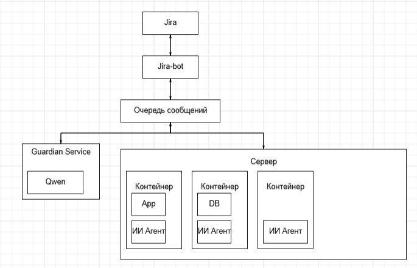
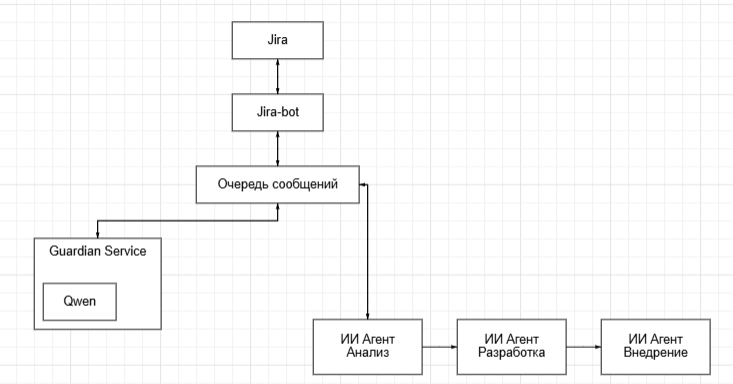
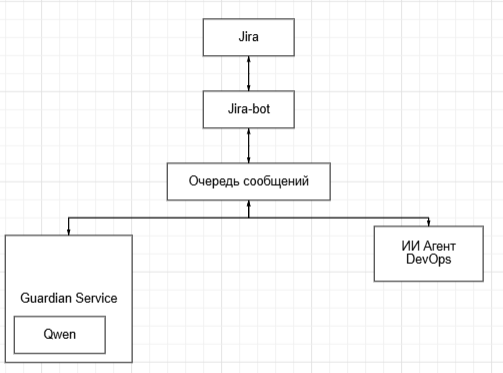

# Multi Agent Executor

EN | [RU](README_ru.md)

Queue-driven multi-agent executor for Jira tasks. The stack runs Jira, PostgreSQL, RabbitMQ, Ollama, Guardian, Jira bot and Nanobot.

## Architecture

### Infrastructure

Jira stores work items, PostgreSQL stores Jira data, RabbitMQ moves messages between services, Ollama provides the local LLM endpoint, Guardian filters unsafe requests, and Nanobot executes approved agent work.



### Agent conveyor

A Jira issue is picked up by `jira-bot`, sent to the message queue, checked by `guardian`, executed by the AI agent, and returned back to Jira as comments or status changes.



### Individual agent

Each agent works through its configured model, workspace, tools and RabbitMQ channel.



## Minimum requirements

- Docker Engine 24+
- Docker Compose v2
- 4 CPU cores
- 8 GB RAM minimum, 16 GB+ recommended for local Ollama models
- 30 GB free disk space
- Free ports: `80`, `1234`, `5555`, `5672`, `8080`, `8081`, `11434`, `15672`, `18790`

## Configuration

Create `.env` in the project root if you need to override defaults:

```env
JIRA_USERNAME=agent-orchestrator
JIRA_PASSWORD=agent-orchestrator
JIRA_SECURITY_REVIEWER_LOGIN=security-user
JIRA_BROWSER_BASE_URL=http://localhost:8080
OLLAMA_MODEL=qwen2.5:14b
```

## Start

```bash
docker compose up -d jira-db rabbitmq ollama
docker exec -it ollama ollama pull qwen2.5:14b
docker compose up -d --build
```

Open Jira and create the bot user from `.env` before assigning issues to it.

## Redeploy

```bash
git pull
docker compose pull
docker compose up -d --build --remove-orphans
```

Force rebuild of local services:

```bash
docker compose build --no-cache jira-bot guardian nanobot
docker compose up -d --remove-orphans
```

## Stop

```bash
docker compose down
```

Stop and delete all Docker volumes:

```bash
docker compose down -v
```

## Logs

```bash
docker compose logs -f --tail=200
```

Only agent services:

```bash
docker compose logs -f --tail=200 jira-bot guardian nanobot
```

## URLs

- Jira: <http://localhost:8080>
- RabbitMQ UI: <http://localhost:15672> / `aiops` / `aiops_secret`
- Ollama: <http://localhost:11434>
- Nanobot gateway: <http://localhost:18790>

## Testing protocol
[testing](testing.md)